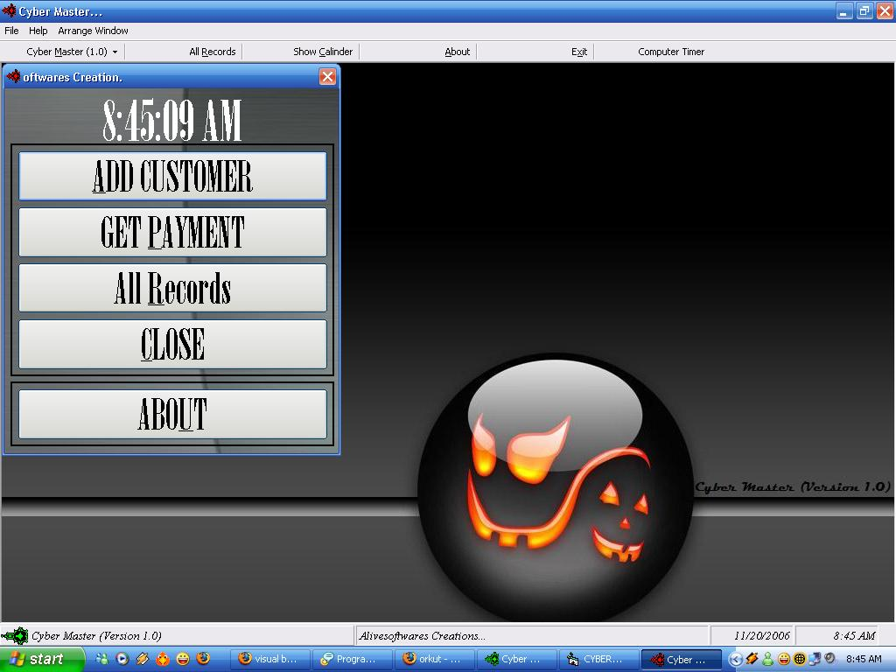



## Cyber Cafe Management

### Description

Purpose of this programme ! well this programme will manage the cyber cafe according to the indian standard time and rates...
 
### More Info
 
Nothing special I've Designed an XP style Button in that so it looks Graphical...

my codes are very simple and its very userfriendly. and in very simple language.

Dont seems to be any more...

I dont think soo any Side Effects will be there.. still under Construction

             |
---                |---
**Submitted On**   |2006-11-03 11:36:28
**By**             |[VJ85](https://github.com/Planet-Source-Code/PSCIndex/blob/master/ByAuthor/vj85.md)
**Level**          |Intermediate
**User Rating**    |4.7 (14 globes from 3 users)
**Compatibility**  |VB 6\.0
**Category**       |[Complete Applications](https://github.com/Planet-Source-Code/PSCIndex/blob/master/ByCategory/complete-applications__1-27.md)
**World**          |[Visual Basic](https://github.com/Planet-Source-Code/PSCIndex/blob/master/ByWorld/visual-basic.md)
**Archive File**   |[Cyber\_Cafe20320011192006\.zip](https://github.com/Planet-Source-Code/vj85-cyber-cafe-management__1-67139/archive/master.zip)

